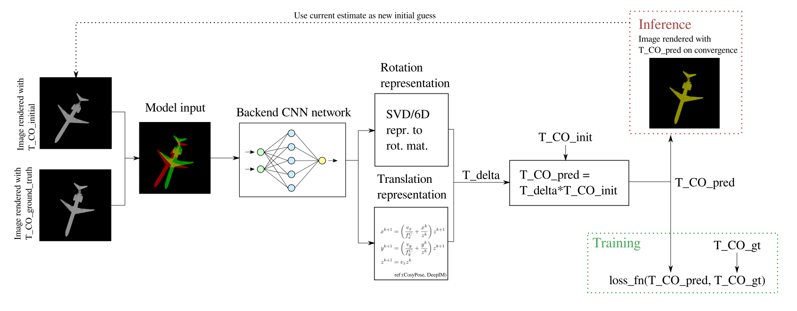

# A baseline for end-to-end RGB render-and-compare pose estimation



A baseline for render-and-compare machine learning pose estimation using a known CAD model, without the use of depth measurements.

The work is inspired by the DeepIM paper and CosyPose paper, but this repository contains a simplified version.
\
The simplifications includes:
- No handling of symmetries
- Simpler renderer compared to CosyPose
- No disentangled loss (see CosyPose)
- No auxiliary training path (DeepIM)
- Baseline network is simple
- No cropped camera matrix

\
Links to DeepIM and CosyPose:

**DeepIM**:
https://arxiv.org/abs/1804.00175

**CosyPose**:
https://arxiv.org/abs/2008.08465
\
https://github.com/ylabbe/cosypose

Snippets of code are copied from the CosyPose github. Copied functions contains an explicit comment about the source.

The repo contains two options for rotation representations:
- A 9D representation that uses SVD to calculate a rotation matrix, from https://arxiv.org/abs/2006.14616
- And a 6D representation that represents two of the axes in the rotation matrix, from https://arxiv.org/abs/1812.07035

# Getting started
## 1: Install dependencies
1. Install torch and cuda from https://pytorch.org/get-started/locally/
2. ```pip install -r requirements.txt```


## 2: Run the baseline
1. Download ModelNet40 from https://modelnet.cs.princeton.edu/
2. Change the dataset path in **normalize_modelnet40.py** and run the file
3. You should now have a directory named "ModelNet40-norm-ply" in project root directory
4. Train the baseline model by running 
```bash
python train_model.py baseline_cfg
```
where **baseline_cfg** is the python config file named **baseline_cfg.py** in the configs directory
\
5. Visualize some results from training the model by running 
```bash
python test_visualization.py baseline_cfg
```

## 3. Change training parameters, network etc.
- All configurations are in the configs file in the config directory
- Change the parameters in those configuration files, or make new ones. New configuration files will save a new state dict of the network in models/saved-models
- If you wish to include another network, place it in models, and implement loading it in **models/fetch_network.py**, then create a new config file for it.

## 4: Suggestions for things to test
- Compare baseline network with EfficientNet (used in CosyPose)
- Compare baseline network with another network of your choice
- Use another version of EfficientNet (current is EfficientNet-b3) for another image size, see if a larger or smaller image size affects the accuracy and robustness of the method. Check out the EfficientNet paper and Pytorch implementation of EfficieNet for the suggested image sizes.
- Compare 6D representation of rotation with 9D representation(SVD)  
- Test multiple feed forward heads on the baseline networks, for individually predicting rotation, horisontal and vertical translation, and depth
- Test different activation functions on these heads
- Change the classes in ModelNet40 the network is trained on, and see if it generalizes well to unseen classes (i.e. remove the "chair" class from training, and test it on the "chair" class after training on other objects)
- Try implementing the disentangled loss from CosyPose and compare with the baseline loss function


# Technical details
## Training process overview
The exact training process depends on the configuration that is set in the config files in the configs directory, but
the overall pipeline is shown below


The general pipeline includes
- A renderer that produces two images of the same object, where the initial guess of the object is slightly off.
- These images are concatenated and used as the input to a convolutional neural network.
- The CNN tries to estimate either a 6D or 9D representation of rotation, and pixel translation in x and y direction, as well as a depth parameter vz.
- The output of the CNN is passed onto a rotation representation function, which calculates a valid rotation matrix
- The pixel translation output of the CNN is converted to translation in Euclidean space.
- Together, the rotation matrix and translation form a transformation matrix delta_T, which updates the current estimate of T_CO with T_CO_new = delta_T*T_CO
- A loss function loss(T_CO_new, T_CO_gt) determines a number which represents the deviation between T_CO_new and T_CO_gt

## Frames
The code in the repository uses shorthand notation for the transformation 
matrix describing the rotation and translation between frames. The image
below shows the shorthand notations used, where T_CO is of particular importance.


**License**:
I included an MIT license, but feel free to copy any code without citing this repository. If you copy any code which stems from another repository in this repository, read their specific license and cite accordingly.

